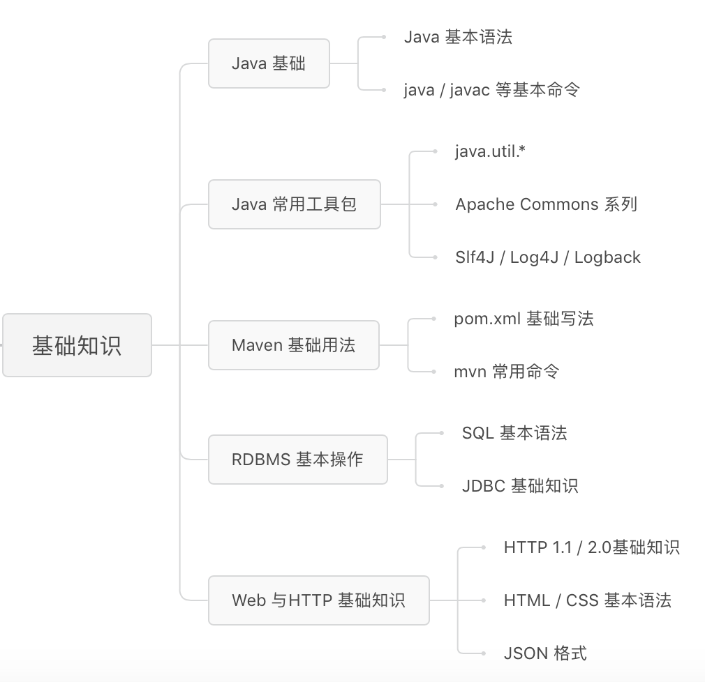
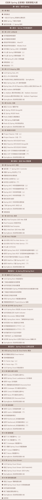

# spring-framework

> spring spring-boot spring-mvc spring-cloud

## 资源

### 项目

> [官方](https://spring.io/)

> [GitHub](https://github.com/spring-projects)

> [spring-framework](https://github.com/spring-projects/spring-framework)

> [spring-boot](https://github.com/spring-projects/spring-boot)

> [spring-cloud](https://github.com/spring-projects/spring-cloud)

### 书籍

> 《Expert One-on-One J2EE Design and Development》

> 《Expert One-on-One J2EE Development without ejb 中文版》

> <Spring Boot 实战 第四版 @ 丁雪峰 201609>

> <Spring Cloud 微服务架构 开发实战 @ 柳伟卫 201806>

> <Spring Cloud与Docker高并发微服务架构设计实施 @ 陈韶健 201806>

> <Spring MVC 学习指南 第二版 @ 林仪明 201705>

> <spring 微服务实战 @ 陈文辉 201806>

> <Spring 源码深度解析 @ 郝佳 201309>

> <Spring Boot 揭秘 - 快速构建微服务体系 @ 王福强 201605>

> <Spring Boot 深入实践 @ 陈韶健 201611>

### 视频

> [玩转Spring全家桶 @ 丁雪丰](https://time.geekbang.org/course/intro/100023501)

> [小马哥讲Spring核心编程思想 @ 小马哥](https://time.geekbang.org/course/intro/100042601)
>
>
> [「一入 Java 深似海 」系列课程 一到八期 @ 小马哥](https://ke.sifou.com/course/1650000021461840)
>
> [Spring Boot 2.0 深度实践之核心技术篇 @ 小马哥](https://coding.imooc.com/class/chapter/252.html)

## 笔记

### 玩转Spring全家桶 @ 丁雪丰

#### 前置基础知识架构图

#### 课程目录

<!--  -->

### 小马哥讲Spring核心编程思想 @ 小马哥 (spring-core-programming-in-thinking)

> [课件源码](https://github.com/geektime-geekbang/geekbang-lessons)
> [课件源码](https://github.com/mercyblitz/geekbang-lessons)
>
> [开源项目周报 @ 小马哥](https://github.com/mercyblitz/tech-weekly)

> [JSR](https://jcp.org)
>
> [JSR](https://github.com/mercyblitz/jsr)
>
> [SPRING_DOC](https://docs.spring.io/spring/docs)
